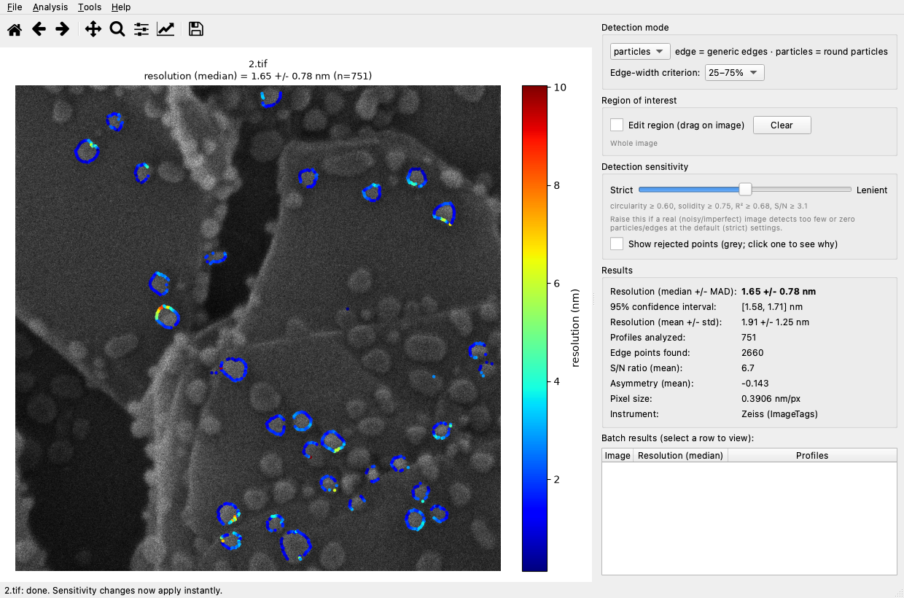
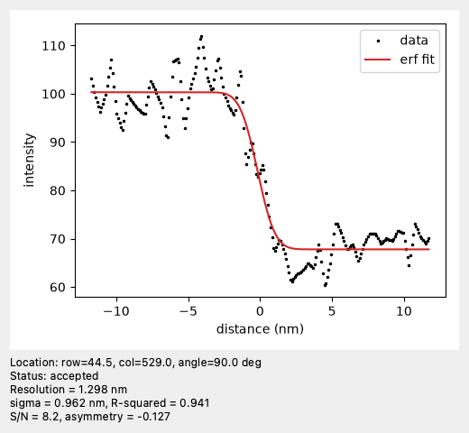

# probesize

**Measure the resolution of your electron or ion microscope directly from its images.**

probesize analyzes SEM / FIB / helium-ion micrographs with the classic
knife-edge (edge-spread-function) method: it finds sharp edges, fits an
error-function model to hundreds of intensity profiles taken perpendicular to
them, and reports the edge width — the instrument's effective resolution — as
robust statistics with full diagnostic plots. Use it as a desktop app, a
command-line tool, or a Python library.



## Features

- **Point at an image, get a number** — vendor metadata (pixel size, info-bar
  height) is read automatically from Zeiss and FEI/Thermo TIFFs; the info bar
  is cropped and 16-bit data is used at full depth.
- **Two detectors** — `edge` for step/knife edges and general structures;
  `particles` for gold-on-carbon style test samples, with shape filtering so
  substrate cracks and folds don't contaminate the measurement.
- **Robust statistics with a real uncertainty** — median ± MAD and mean ± std
  over all accepted profiles, plus a 95% bootstrap confidence interval on the
  median (the uncertainty of the *estimate*, not just the spread of
  measurements) and signal-to-noise / edge-asymmetry summaries.
- **Interactive tuning that's instant** — the image is analyzed once; the
  sensitivity slider, region-of-interest rectangle, and threshold changes are
  pure re-filters of the stored fits (milliseconds, not re-analysis).
- **Full transparency** — click any measurement point to see its raw profile
  and fit; show rejected points to see exactly why each one was excluded.
- **Anisotropy at a glance** — the polar plot shows resolution vs. edge
  orientation; astigmatism or coma appears as a non-circular distribution.
- **Batch + reports** — analyze whole folders; every run can write JSON and
  text reports plus annotated-image, histogram, and polar plots, and a batch
  writes a `summary.csv` (one row per image) for tracking resolution across a
  sample set or over time in any spreadsheet.
- **Never blocked by missing calibration** — uncalibrated images are measured
  in pixels (clearly labeled), and you can type in a pixel size at any time to
  convert instantly.

## Installation

Requires Python 3.9+.

```bash
git clone <repository-url>
cd probesize
python3 -m venv .venv && source .venv/bin/activate
pip install -e ".[gui]"          # omit [gui] for the CLI/library only
```

## Quick start

### Desktop app

```bash
probesize-gui
```

1. **File → Open Image...** — the analysis runs automatically and the image
   appears with every measured point colored by its local resolution.
2. Pick the **detection mode** for your sample: `edge` (default) for a
   knife/step edge, `particles` for a field of round test particles.
3. Read the answer off the **Results** panel — *Resolution (median ± MAD)* is
   the headline number. Click any colored point to inspect its fit.

If the image looks under-detected (few or no points), drag the **Detection
sensitivity** slider toward *Lenient* — results update instantly.

### Command line

```bash
probesize image.tif                          # analyze one image, write reports
probesize --mode particles image.tif         # gold-on-carbon style samples
probesize --batch images/ --out results/     # every image in a folder
probesize -s image.tif                       # print one line, for scripts
```

### Python

```python
from probesize import AnalysisParams, analyze_image

result = analyze_image("image.tif", AnalysisParams(detection_mode="particles"))
print(f"resolution: {result.resolution_median_nm:.2f} ± {result.resolution_mad_nm:.2f} {result.units}")
print(f"from {result.n_profiles_analyzed} edge profiles")
```

## Supported inputs

| Source | What is read automatically |
|---|---|
| **Zeiss** (SmartSEM, GeminiSEM, ORION NanoFab HIM) | pixel size and scan dimensions from the `ImageTags` XML (TIFF tag 65000), CZ_SEM tag as fallback; info bar cropped |
| **FEI / Thermo Fisher** (Helios, Nova, Quanta, Verios) | pixel size from `[Scan] PixelWidth`, data-bar height from the tag-34682 INI block; 16-bit data kept at full depth |
| **Generic calibrated TIFF** | `XResolution`/`ResolutionUnit` (desktop-publishing defaults like 72/96 dpi are recognized as bogus and ignored) |
| **Anything else** (PNG, JPG, uncalibrated TIFF) | analyzed in **pixel units**, clearly labeled `px` everywhere |

For uncalibrated images you can supply the pixel size manually — the
**Manual calibration** box in the GUI (appears only when the image has no
calibration of its own; converts instantly) or `--fallback-pixel-size-nm` on
the CLI. A manual value never overrides an embedded calibration. Scripts that
must never run uncalibrated can pass `--require-calibration`.

Adding another vendor is one small parser function in
[`metadata.py`](src/probesize/metadata.py) — contributions welcome.

## The GUI in more detail

- **Detection mode** — switch between the edge and particle detectors;
  switching re-analyzes the current image (or the whole loaded batch).
- **Edge-width criterion** — dropdown to switch between the 25–75% and
  20–80% conventions; the change is a pure rescale of the stored fits, so
  all numbers, plots, and batch rows update instantly. Other percentile
  pairs can be set in **Analysis → Settings...** (shown as *custom* here).
- **Region of interest** — check *Edit region*, drag a rectangle over the
  area you care about (move/resize by its handles), uncheck to lock it. Only
  profiles inside count toward the statistics; everything else is excluded
  instantly and the box is drawn on exported images too.
- **Detection sensitivity** — one slider over the quality thresholds
  (circularity/solidity in particle mode, gradient significance in edge mode,
  fit R²/S-N in both). Strict favors clean, unambiguous measurements; lenient
  favors coverage on noisy or imperfect images. Changes apply instantly.
- **Show rejected points** — overlays every excluded candidate in grey; click
  one to see exactly which check it failed and its fit.
- **Manual calibration** — appears when the image carries no pixel size;
  enter one and every number converts from px to nm on the spot.
- **Tools → Histogram** — resolution distribution with adjustable binning,
  updates live as you tune.
- **Tools → Polar Plot** — resolution vs. edge-normal angle, oriented to
  match the image (0° right, 90° down). A non-circular cloud indicates
  astigmatism or coma. Scroll or use the buttons to zoom the radial axis;
  click a point to highlight where it came from on the main image.
- **Click any point** for the profile inspector — the raw intensity data,
  the fitted edge model, and the per-profile numbers:

  

- **Batch folders** populate a summary table; select a row to view that
  image without re-analyzing. **File → Save Results...** writes the same
  reports as the CLI.

## Command-line reference

Each run writes `<name>_result.json`, `<name>_result.txt`, and (unless
`--no-plots`) `<name>_annotated.jpg`, `<name>_histogram.png`,
`<name>_polar.png` — by default next to the input, or into `--out DIR`. A
`--batch` run additionally writes `summary.csv`, one row per image (median,
95% CI, MAD, mean/std, profile count, S/N, vendor, calibration, region). The
GUI writes the same via **File → Export Batch Summary (CSV)...**.

Common options:

| Option | Purpose |
|---|---|
| `--mode {edge,particles}` | detector to use (default `edge`) |
| `--criterion lo,hi` | edge-width criterion (default `0.25,0.75`; e.g. `0.2,0.8`) |
| `--pixel-size-nm X` | force a pixel size for **all** images |
| `--fallback-pixel-size-nm X` | pixel size for **uncalibrated** images only |
| `--require-calibration` | fail on uncalibrated images instead of using px units |
| `--region X0,Y0,X1,Y1` | restrict measurements to a rectangle (pixels) |
| `--r-squared-min`, `--snr-min` | fit-acceptance thresholds |
| `-s` | print a single resolution line (for scripting) |

Edge mode is tuned with `--min-spacing-px`, `--canny-sigma`,
`--min-gradient-snr`; particle mode with `--min-radius-nm`, `--max-radius-nm`,
`--background-radius-nm`, `--min-solidity`, `--min-circularity`,
`--contour-spacing-px`. Run `probesize --help` for everything.

## How it works

1. **Load & calibrate** — a registry of per-vendor parsers
   ([`metadata.py`](src/probesize/metadata.py)) reads the pixel size and
   info-bar height; the bar is cropped and high-bit-depth data is kept as-is.
2. **Find candidate edges** — `edge` mode runs Canny detection with a robust,
   image-derived noise-floor estimate, thinning candidates to a minimum
   spacing; `particles` mode segments compact round blobs
   (difference-of-Gaussians background flattening → Otsu threshold → filters
   on size, circularity, convexity) and samples each accepted particle's
   perimeter.
3. **Sample profiles** — at every candidate point an intensity profile is
   extracted perpendicular to the edge by bilinear interpolation, averaging
   several parallel lines along the edge tangent to suppress shot noise (the
   averaging window is automatically capped for small particles so boundary
   curvature doesn't inflate the width).
4. **Fit & measure** — each profile is fit to the edge-spread function
   `I(x) = lo + (hi−lo)/2 · (1 + erf((x−x0)/(√2·σ)))`; the resolution is the
   distance between two intensity-fraction crossings (default 25%/75%). Fits
   that fail to converge, lack contrast, or fall below the R²/S-N thresholds
   are rejected with a recorded reason.
5. **Aggregate & report** — statistics over all accepted profiles, the
   annotated overlay, histogram, and polar plot.

## Interpreting results

- **Prefer the median ± MAD.** A few bad profiles (touching particles,
  contamination) produce a long tail that skews the mean far more than the
  median.
- **MAD vs. the 95% CI are different quantities.** The MAD is how much
  individual edge measurements *scatter*; the 95% confidence interval is how
  well the *median itself* is pinned down (it shrinks as more profiles
  contribute). Report the CI as your uncertainty, not the MAD.
- **Always report the criterion.** A "25–75% edge width" and a "20–80% edge
  width" of the same image differ by a fixed factor — quote which one you
  used (`--criterion`).
- **Real images are noisy.** Don't expect the near-perfect R² of synthetic
  data; the sensitivity slider (or `--r-squared-min`/`--snr-min`) trades
  strictness against how many profiles survive.
- **Check the polar plot** before trusting a single number — a strongly
  elliptical distribution means the resolution is direction-dependent
  (astigmatism/coma) and one scalar undersells the situation.

## Development

```bash
pip install -e ".[dev,gui]"
pytest
```

The test suite (96 tests) covers ground-truth recovery on synthetic images
with known blur, vendor metadata parsing against real instrument files,
refilter-equivalence guarantees, and headless GUI interaction
(`QT_QPA_PLATFORM=offscreen`); GUI tests skip automatically when the `gui`
extra isn't installed.

## License

MIT — see [LICENSE](LICENSE).
